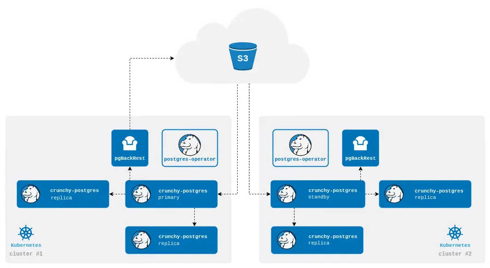

### System Architecture

In this demo, we will use Crunchy Postgres to deploy a database cluster that closely resembles a production environment. Crunchy Postgres is an open-source solution that helps create PostgreSQL clusters on Kubernetes. **Crunchy Postgres for Kubernetes** provides everything you need, from **high-availability** and **disaster recovery** to **monitoring**. This section will demonstrate how a Crunchy Postgres deployment assembles these components together.


Demo PostgreSQL Cluster Deployment Model on GKE with Crunchy Postgres

**Operator**

**PGO** - **Postgres Operator** from **Crunchy Data**, operates as a **Kubernetes Deployment** and consists of a single container. This container contains a set of **Kubernetes controllers** that manage both:

- Native Kubernetes resources (such as **Jobs**, **Pods**)
- And **Custom Resources** (such as **PostgresCluster**)

**Crunchy Postgres**

**Crunchy Postgres for Kubernetes** allows you to deploy **Crunchy Postgres** clusters (Crunchy Data's open-source PostgreSQL distribution) on Kubernetes in a **native** and **production-ready** manner.

To achieve this, **Crunchy Postgres for Kubernetes** uses:

- **Kubernetes StatefulSets** to create PostgreSQL instance groups
- Support for advanced operations like **rolling updates** (minimizing downtime)
- And support for **affinity** and **tolerations** rules to ensure replicas are properly distributed across multiple nodes or different geographical zones.

---

**pgBackRest**

A production-ready PostgreSQL cluster requires a **disaster recovery** solution.

**Crunchy Postgres for Kubernetes** uses **pgBackRest** to:

- Backup and restore data
- Perform scheduled backups
- Execute ad-hoc backups
- And support **point-in-time recovery** (restoring to a specific point in time)

**Crunchy Postgres for Kubernetes** runs **pgBackRest** in the same Pod as the Crunchy Postgres container, but can also be separated into an independent Pod to manage backups with cloud storage services.

---

**Patroni**

To ensure data is always available (**high availability**), a PostgreSQL cluster needs:

- A **leader**
- And multiple **replicas**

If the **leader instance** fails, **Crunchy Postgres for Kubernetes** uses **Patroni** to automatically **promote** a replica to become the new leader.

Each container running a Crunchy Postgres instance comes with built-in **Patroni** to:

- Coordinate the **failover** process
- Maintain data availability

---

**Monitoring Stack**

**Crunchy Postgres for Kubernetes** provides a **monitoring stack** to help you:

- Monitor the health of the PostgreSQL cluster
- Observe workload
- Set up dashboards, alerts, and detailed insights

Even with high availability, backup, and disaster recovery in place, **monitoring** helps **detect issues before they impact** the system.

### Setting up GKE cluster and GCS bucket

```bash
gcloud container clusters create $CLUSTER_NAME \
    --num-nodes=3 \
    --machine-type=n1-standard-2 \
    --disk-size=60GB \
    --zone=$ZONE \
    --release-channel=regular

gcloud container clusters get-credentials $CLUSTER_NAME --zone $ZONE

kubectl config current-context
    
gcloud iam service-accounts create pgbackup-sa \
    --description="Service account for Postgres backup to GCS" \
    --display-name="Postgres Backup SA"

gcloud projects add-iam-policy-binding $PROJECT_ID \
    --member="serviceAccount:pgbackup-sa@$PROJECT_ID.iam.gserviceaccount.com" \
    --role="roles/storage.admin"

gcloud iam service-accounts keys create ./pgbackup-sa-key.json \
    --iam-account=pgbackup-sa@$PROJECT_ID.iam.gserviceaccount.com

cp pgbackup-sa-key.json postgres-operator-examples/kustomize/demo-postgres/gcs-key.json 

gsutil mb -l $REGION -p $PROJECT_ID gs://$BUCKET_NAME
```

### Installing Crunchy and Creating PostgreSQL Cluster

This deployment guide references the official Crunchy Postgres documentation at https://access.crunchydata.com/documentation/postgres-operator/latest/quickstart

First, let's introduce the initial components when the research team initializes this cluster

```bash
apiVersion: postgres-operator.crunchydata.com/v1beta1
kind: PostgresCluster
metadata:
  name: dba-postgres
spec:
  postgresVersion: 17
  users:
    - name: postgres
    - name: dbateam
      databases:
        - dbateamdb
  instances:
    - name: pg-instance
      replicas: 1
      dataVolumeClaimSpec:
        accessModes:
        - "ReadWriteOnce"
        resources:
          requests:
            storage: 5Gi
      
  backups:
    pgbackrest:
      repos:
      - name: repo1
        volume:
          volumeClaimSpec:
            accessModes:
            - "ReadWriteOnce"
            resources:
              requests:
                storage: 5Gi
```

This configuration will create a new PostgreSQL cluster named `dba-postgres` with 1 pod. The cluster configuration includes:

- PostgreSQL version 17
- A `dbateam` user with database `dbateamdb`, while also providing access to the superuser postgres (for demo purposes)
- One instance with 5Gi storage
- Backup configuration using pgBackRest with a 5Gi repository

```bash
kubectl apply -k kustomize/install/namespace
kubectl apply --server-side -k kustomize/install/default
kubectl apply -k kustomize/demo-postgres
```

After running these three commands, we have created a new namespace called `postgres-operator` in the Kubernetes cluster. This namespace will be used to contain all resources related to the PostgreSQL operator, and from here we will manage this cluster within this namespace.

Next, we installed the PostgreSQL operator into the `postgres-operator` namespace we created.

To verify, we can use the following commands:

```bash
kubectl get pod,svc -n postgres-operator
kubectl -n postgres-operator get pods --selector=postgres-operator.crunchydata.com/cluster=dba-postgres,postgres-operator.crunchydata.com/instance
kubectl -n postgres-operator describe postgresclusters.postgres-operator.crunchydata.com dba-postgres
```

The results are as follows:

```bash
$ kubectl get pod,svc -n postgres-operator
NAME                                  READY   STATUS      RESTARTS   AGE
pod/dba-postgres-backup-77bt-9f4qr    0/1     Completed   0          12m
pod/dba-postgres-pg-instance-mbb7-0   4/4     Running     0          12m
pod/dba-postgres-repo-host-0          2/2     Running     0          12m
pod/pgo-77d887556d-jjw5p              1/1     Running     0          21m

NAME                             TYPE        CLUSTER-IP       EXTERNAL-IP   PORT(S)    AGE
service/dba-postgres-ha          ClusterIP   34.118.234.141   <none>        5432/TCP   13m
service/dba-postgres-ha-config   ClusterIP   None             <none>        <none>     13m
service/dba-postgres-pods        ClusterIP   None             <none>        <none>     13m
service/dba-postgres-primary     ClusterIP   None             <none>        5432/TCP   13m
service/dba-postgres-replicas    ClusterIP   34.118.226.127   <none>        5432/TCP   13m
```

| Service Name | Type (ClusterIP/headless) | Points to | Main Purpose |
| --- | --- | --- | --- |
| **`dba-postgres-ha`** | `ClusterIP` (with address 34.118.234.141) | Only **one** pod holding the *leader* (primary) role – Endpoints list is continuously updated by Patroni | Provides a stable **HA** access point. Applications can maintain read-write connections through automatic Endpoint switching during failover |
| **`dba-postgres-ha-config`** | **Headless** (`clusterIP: None`, no ports exposed) | Not exposed externally; only contains the `Endpoints` object used by Patroni as **Distributed Configuration Store (DCS)** | Exchanges HA configuration (leader-lock, cluster-state, etc.). Not for application use |
| **`dba-postgres-pods`** | **Headless** (`clusterIP: None`) | **All** pods (primary + replica) – selected by label `postgres-operator.crunchydata.com/cluster=dba-postgres` | Provides DNS in the form `pod-name.dba-postgres-pods.<ns>.svc` for replication, debugging, or side-car |
| **`dba-postgres-primary`** | **Headless** (`clusterIP: None`, port 5432) | The only *leader* pod (similar to `*-ha` but with a more explicit name) | "Official" hostname for TLS CN/SAN and for all operations requiring guaranteed writes to primary |
| **`dba-postgres-replicas`** | `ClusterIP` (34.118.226.127) | All pods with label `role=replica` (Endpoints updated during failover) | Separates **read-only** workload/reporting load. Can be attached to LoadBalancer or Ingress for external read access |

### Connecting to Postgres Cluster

**Port-forwarding to PostgreSQL instance**

```bash
PG_CLUSTER_PRIMARY_POD=$(kubectl get pod -n postgres-operator -o name -l postgres-operator.crunchydata.com/cluster=dba-postgres,postgres-operator.crunchydata.com/role=master)

kubectl -n postgres-operator port-forward "${PG_CLUSTER_PRIMARY_POD}" 5432:5432
Forwarding from 127.0.0.1:5432 -> 5432
Forwarding from [::1]:5432 -> 5432
Handling connection for 5432
```

**Connect from localhost**

```bash
PG_CLUSTER_USER_SECRET_NAME=dba-postgres-pguser-dbateam

PGPASSWORD=$(kubectl get secrets -n postgres-operator "${PG_CLUSTER_USER_SECRET_NAME}" -o go-template='{{.data.password | base64decode}}') 
PGUSER=$(kubectl get secrets -n postgres-operator "${PG_CLUSTER_USER_SECRET_NAME}" -o go-template='{{.data.user | base64decode}}') 
PGDATABASE=$(kubectl get secrets -n postgres-operator "${PG_CLUSTER_USER_SECRET_NAME}" -o go-template='{{.data.dbname | base64decode}}')

PGUSER=$PGUSER PGPASSWORD=$PGPASSWORD PGDATABASE=$PGDATABASE psql -h localhost
```


**Connect from internal psql-client**

Alternatively, you can create a temporary pod to connect from within the cluster network through the `dba-postgres-ha` service:

```bash
$ kubectl run psql-client --rm -i -t --image=postgres:17 --namespace=postgres-operator -- bash
If you don't see a command prompt, try pressing enter.
root@psql-client:/# export PGPASSWORD=":e[0Y9E_@I.gck4o[}zi/;{s"
root@psql-client:/# psql -h dba-postgres-ha.postgres-operator.svc.cluster.local -U postgres
<SNIP>

postgres=#
```

### **Backup Configuration and Management**

As introduced, Crunchy Postgres uses the open-source solution [pgBackRest](https://github.com/pgbackrest/pgbackrest) which supports many backup storage options. Here, the research team will demonstrate two typical examples:

- Kubernetes PVC (Persistent Volume Claim)
- Google Cloud Storage (GCS) representing cloud provider storage (Crunchy also supports AWS S3 or S3-compatible storage like MinIO and Azure Blob Storage)

It also supports multiple backup types:

- **`full`**: Complete backup
- **`differential`**: Backup since the last **`full`** backup
- **`incremental`**: Backup since the last **`full`**, **`differential`**, or **`incremental`** backup

Detailed installation can be found in the documentation. Let's go through some key points in the setup:

```bash
  backups:
    pgbackrest:
      configuration:
      - secret:
          name: pgo-gcs-creds
      global:
        repo1-path: /pgbackrest/postgres-operator/dba-postgres/repo1
        repo1-retention-full: "14"
        repo1-retention-full-type: "count"        
        repo2-retention-full: "14"
        repo2-retention-full-type: "count" 
      repos:
      - name: repo1
        schedules:
          full: '0 1 * * *'
          incremental: "0 */4 * * *"
        gcs:
          bucket: "<my-postgres-backup-bucket>"
      - name: repo2
        schedules:
          full: '0 1 * * *'
          incremental: "0 */4 * * *"
        volume:
          volumeClaimSpec:
            accessModes:
            - "ReadWriteOnce"
            resources:
              requests:
                storage: 5Gi
```

In the additional configuration for pgBackRest, besides the credential configuration for connecting to the GCS bucket, the team has added backup management and scheduling:

- `repo*-retention-full` = `"14"` – keep the **14 most recent full** backups
- `repo*-retention-full-type` = `"count"` – interpret the above number as a **count**, not days. When the 15th full backup completes, the oldest full backup and all related incremental/WAL files will be deleted
- PGO will create **CronJob** to call pgBackRest according to schedule: `full: '0 1 * * *'` → run full backup daily at 01:00 (according to cluster UTC)
- `incremental: '0 */4 * * *'` → run incremental every 4 hours

To verify these settings are working:

```bash
$ kubectl get cronjob,job -n postgres-operator
NAME                                    SCHEDULE      TIMEZONE   SUSPEND   ACTIVE  
cronjob.batch/dba-postgres-repo1-full   0 1 * * *     <none>     False     0        
cronjob.batch/dba-postgres-repo1-incr   0 */4 * * *   <none>     False     0        
cronjob.batch/dba-postgres-repo2-full   0 1 * * *     <none>     False     0        
cronjob.batch/dba-postgres-repo2-incr   0 */4 * * *   <none>     False     0        

NAME                                 STATUS     COMPLETIONS   DURATION   AGE
job.batch/dba-postgres-backup-77bt   Complete   1/1           3m25s      75m
$ kubectl get pod -n postgres-operator
NAME                              READY   STATUS      RESTARTS   AGE
dba-postgres-backup-77bt-9f4qr    0/1     Completed   0          75m
dba-postgres-pg-instance-mbb7-0   4/4     Running     0          76m
dba-postgres-repo-host-0          2/2     Running     0          76m
pgo-77d887556d-jjw5p              1/1     Running     0          85m
psql-client                       1/1     Running     0          24m
$ kubectl get pvc -n postgres-operator
NAME                                   STATUS   VOLUME                     CAPACITY   
dba-postgres-pg-instance-mbb7-pgdata   Bound    pvc-a9f00...<SNIP>...0f0   5Gi        
dba-postgres-repo2                     Bound    pvc-29ad9...<SNIP>...ebe   5Gi        
```

Check your created bucket:


GCS bucket details after backup

The backup will serve Disaster Recovery and Cloning scenarios. Due to time and cloud usage cost limitations, the team did not implement these scenarios. Below is an illustration of the scenario for recovery or cloning to another cluster through backup data on cloud storage.



Repo-based Standby

Additionally, we can perform replication between database clusters or K8s clusters as long as there is network connectivity:


Streaming Standby

### High Availability

With high availability, we have many approaches to the database cluster deployed in the K8s environment.

**Scaling the cluster - increasing replica count and verifying HA capability**

Here we will try to increase the PostgreSQL instance replicas to 3 - 3 pods will be running:

```bash
  instances:
    - name: pg-instance
      replicas: 3
      dataVolumeClaimSpec:
        accessModes:
        - "ReadWriteOnce"
        resources:
          requests:
            storage: 5Gi
```

After redeploying, we can verify and see that the number of pods for the instance has increased to 3:

```bash
$ kubectl get pods -n postgres-operator --selector=postgres-operator.crunchydata.com/instance-set -L postgres-operator.crunchydata.com/role
NAME                              READY   STATUS    RESTARTS   AGE   ROLE
dba-postgres-pg-instance-mbb7-0   4/4     Running   0          98m   master
dba-postgres-pg-instance-mhst-0   4/4     Running   0          98m   replica
dba-postgres-pg-instance-rf7h-0   4/4     Running   0          98m   replica
```

Check synchronization status, we can see that Asynchronous Streaming Replication is currently being used:

```bash
postgres=# select application_name, state, sync_state from pg_stat_replication;
        application_name         |   state   | sync_state
---------------------------------+-----------+------------
 dba-postgres-pg-instance-mhst-0 | streaming | async
 dba-postgres-pg-instance-rf7h-0 | streaming | async
(2 rows)
```

Try deleting the primary pod to see the response:

```bash
PRIMARY_POD=$(kubectl -n postgres-operator get pods --selector=postgres-operator.crunchydata.com/role=master -o jsonpath='{.items[*].metadata.labels.postgres-operator\.crunchydata\.com/instance}')
minhtq23@ANM-MINHTQ23:~/gcp/postgresql-cluster/postgres-operator-examples$ kubectl delete sts -n postgres-operator "${PRIMARY_POD}"
statefulset.apps "dba-postgres-pg-instance-mbb7" deleted
$ kubectl get pods -n postgres-operator --selector=postgres-operator.crunchydata.com/instance-set -L postgres-operator.crunchydata.com/role
NAME                              READY   STATUS    RESTARTS   AGE    ROLE
dba-postgres-pg-instance-mbb7-0   4/4     Running   0          35s    replica
dba-postgres-pg-instance-mhst-0   4/4     Running   0          100m   replica
dba-postgres-pg-instance-rf7h-0   4/4     Running   0          100m   master
```

As we can see, Kubernetes and Crunchy Postgres with Patroni have provided excellent and quick support for electing a new primary.

**Additional Patroni configuration**

We have some basic configurations for Patroni, the HA coordination tool:

- `failsafe_mode: true` - Enables **DCS Failsafe Mode**. If Patroni *loses connection* to DCS (Kubernetes API/etcd/Consul) but can still "see" all members via REST API, the **primary continues to serve writes** instead of self-demoting to read-only.
    
    This approach reduces the risk of **split-brain** arising from network issues between DB and DCS; keeps applications online even when K8s control-plane has issues.
    
- `synchronous_mode: true` Switches to synchronous replication mode, transactions only complete when WAL is written to at least 1 standby ⇒ **RPO near 0** in fail-over, in exchange for increased write latency. This option is enabled for workloads **sensitive to data loss** (finance, payments...), accepting the performance trade-off.
- `synchronous_mode_strict: true` If no synchronous standby is available, the cluster will stop writing. This ensures every transaction is always durable on ≥ 1 standby, but **reduces availability**: if all synchronous standbys are down, the primary freezes writes.

```bash
  patroni:
    dynamicConfiguration:
      synchronous_mode: true
      synchronous_mode_strict: true
      failsafe_mode: true
```

Check replication status again, one replica has been switched to synchronous replication to acknowledge commits with primary:

```bash
postgres=# select application_name, state, sync_state from pg_stat_replication;
        application_name         |   state   | sync_state
---------------------------------+-----------+------------
 dba-postgres-pg-instance-mhst-0 | streaming | sync
 dba-postgres-pg-instance-mbb7-0 | streaming | async
(2 rows)
```

**Pod Scheduling**

With Kubernetes, we can add Node Affinity and Pod Anti-Affinity mechanisms, but these won't be covered in this demo as they mainly relate to K8s concepts. The basic methodology of this strategy would be to schedule pod deployment evenly across nodes and zones that are not faulty or are tagged as nodes for running database pods or backup pods.

### Monitoring

Add configuration to add metric exporters to the pods. Here we use pgMonitor to export PostgreSQL-specific metrics. Prometheus will collect these metrics and provide them to Alertmanager for alerts if needed and Grafana for web interface observation.

```bash
  monitoring:
    pgmonitor:
      exporter: {}
```

Then apply monitoring settings to deploy Prometheus, Grafana and Alertmanager, then connect to Grafana's web interface with port-forward:

```bash
kubectl apply -k kustomize/monitoring

kubectl -n postgres-operator port-forward service/crunchy-grafana 3000:3000
```

Here the team won't go too deep into demonstrating Grafana usage. We'll quickly look at some features to understand the basic roles. First, after logging in, we'll have dashboards grouped and tagged by the exporter we used:


Grafana dashboard interface after login

In the Query Statistics section, query parameters and history will be fully tracked on Grafana:


Grafana Query Statistics section

We also have resource metrics for the pods running PostgreSQL:


Grafana Pod Details section

To observe general cluster information, we can go to PostgreSQLDetails:


Grafana PostgreSQLDetails section

### Administration - pgAdmin

**PgAdmin** is an open-source database management tool commonly used for **PostgreSQL**. It provides a user-friendly **graphical interface**, helping users easily perform database management tasks without needing to use complex command-line commands.

With our current deployment approach, we can easily run an additional pgAdmin pod in the cluster and connect to the cluster through the HA service with domain name and perform operations with pgAdmin's interface.


pgAdmin interface for database operations